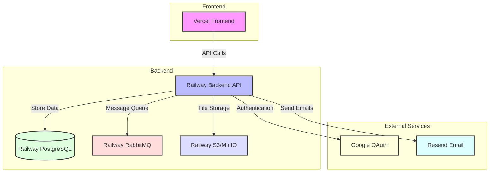

# Deployment Guide

## Architecture Overview



## Deploy the frontend

- Go to vercel dashboard
- Link to github monorepo project
- Define build folder as /frontend
- Setup all the necessary .env variables:
  - `NEXT_PUBLIC_API_URL`: Your backend API URL
  - `NEXT_PUBLIC_BLOB_STORAGE_URL`: Your MinIO/S3 URL
  - `NODE_ENV`: Set to "production"
- Ensure all URL and configurations are correct

## Deploy the services

### Deploy the databases

1. **Create PostgreSQL Database on Railway**:

   - Go to Railway dashboard
   - Click "New Project"
   - Select "Provision PostgreSQL"
   - Configure database settings:
     - Name: `auth-db`
     - Region: Choose closest to your users
   - Get connection string and update backend environment variables:
     - `POSTGRES_URI`: Your Railway PostgreSQL connection string
     - `POSTGRES_TEST_URI`: Your test database connection string (if needed)

2. **Create Test Database** (Optional):
   - Repeat above steps for test database
   - Use different name: `auth-db-test`

### Deploy the Message Broker

1. **Create RabbitMQ Instance on Railway**:
   - Go to Railway dashboard
   - Click "New Project"
   - Select "Provision RabbitMQ"
   - Configure settings:
     - Name: `auth-rabbitmq`
     - Region: Same as database
   - Get connection URL and update backend environment variables:
     - `RABBITMQ_URL`: Your RabbitMQ connection string
     - `RABBITMQ_DEFAULT_USER`: Username
     - `RABBITMQ_DEFAULT_PASS`: Password

### Deploy the APIs

1. **Deploy Backend Service on Railway**:

   - Go to Railway dashboard
   - Click "New Project"
   - Select "Deploy from GitHub repo"
   - Choose your backend service directory
   - Configure environment variables:
     ```env
     NODE_ENV=production
     POSTGRES_URI=your-railway-postgres-uri
     POSTGRES_TEST_URI=your-railway-test-postgres-uri
     JWT_SECRET=your-jwt-secret
     GOOGLE_CLIENT_ID=your-google-client-id
     GOOGLE_CLIENT_SECRET=your-google-client-secret
     GOOGLE_CALLBACK_URL=your-backend-url/auth/google/callback
     RABBITMQ_URL=your-rabbitmq-url
     RESEND_API_KEY=your-resend-api-key
     ```
   - Set build command: `npm run build`
   - Set start command: `npm run start:prod`

2. **Configure Domain and SSL**:

   - In Railway dashboard, go to your backend service
   - Click "Settings" > "Domains"
   - Add your custom domain or use Railway's provided domain
   - Enable SSL certificate

3. **Update Frontend Configuration**:
   - Update `NEXT_PUBLIC_API_URL` in Vercel to point to your deployed backend URL

### Deploy MinIO/S3 Storage

1. **Option 1: Use Railway's S3 Service**:

   - Go to Railway dashboard
   - Click "New Project"
   - Select "Provision S3"
   - Configure bucket settings
   - Get credentials and update environment variables:
     - `MINIO_ACCESS_KEY`: Your S3 access key
     - `MINIO_SECRET_KEY`: Your S3 secret key
     - `MINIO_BUCKET`: Your bucket name
     - `MINIO_URL`: Your S3 endpoint URL

2. **Option 2: Deploy MinIO on Railway**:
   - Create new project
   - Add `docker-compose.yml` with MinIO configuration
   - Configure environment variables:
     - `MINIO_ROOT_USER`: Your access key
     - `MINIO_ROOT_PASSWORD`: Your secret key
   - Get connection URL and update frontend/backend environment variables

## Post-Deployment Steps

1. **Verify Services**:

   - Check all services are running in Railway dashboard
   - Verify database connections
   - Test message broker connectivity
   - Confirm file storage access

2. **Update DNS Records**:

   - If using custom domains, update DNS records
   - Point domains to Railway/Vercel services
   - Wait for DNS propagation

3. **Test Authentication Flow**:

   - Test local sign-in
   - Test Google OAuth
   - Verify JWT token generation
   - Check protected routes

4. **Monitor and Scale**:
   - Set up monitoring in Railway dashboard
   - Configure auto-scaling if needed
   - Set up alerts for service health

## Troubleshooting

1. **Database Connection Issues**:

   - Check connection strings
   - Verify database credentials
   - Ensure network access is allowed

2. **Message Broker Issues**:

   - Check RabbitMQ connection URL
   - Verify credentials
   - Check queue health

3. **Storage Issues**:

   - Verify S3/MinIO credentials
   - Check bucket permissions
   - Confirm CORS settings

4. **API Issues**:
   - Check environment variables
   - Verify service logs
   - Test endpoints with Postman/curl
