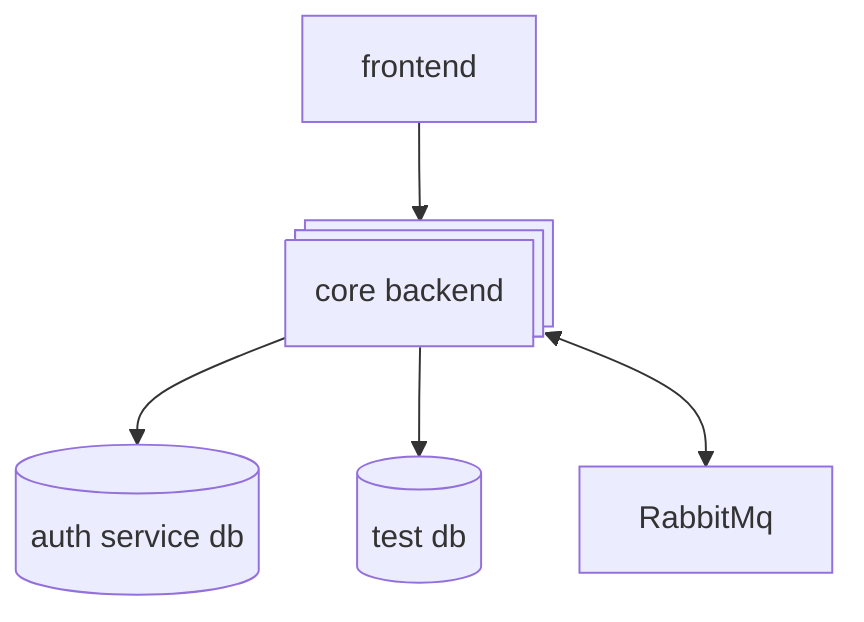

# Microservice project

## Tech stack

- docker and docker compose
- NestJS
- NextJS
- Postgres
- RabbitMQ

# Features

- Microservice architecture
- Message broker between microservices
- Auth ( Credentials and Oauth2 strategies )
- NextJs frontend

## Architecture overview



## Run the project

copy and fill the env variables

```sh
cp .env.example .env
```

Launch the services

```sh
docker compose up --build -d
```

### About the authors

## [<br /><sub><a href="https://github.com/naikibro">Vaanaiki Brotherson</a></sub>](https://github.com/naikibro)

🚀 **Happy Coding!**
