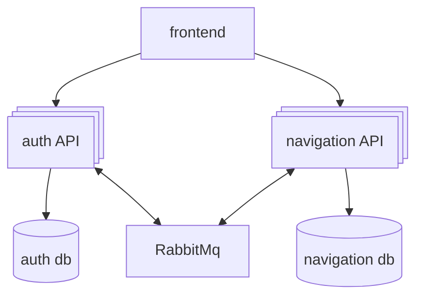

# Supmap

an [MIT licensed project](./LICENSE)

Supmap is a real-time navigation and community-driven traffic alert application inspired by Waze. It enables users to navigate with optimized routes, receive and report live incidents (accidents, traffic jams, road closures, police controls, obstacles), and contribute to the reliability of alerts through community validation. Supmap features a mobile app for navigation and reporting, a web dashboard for data management, and a scalable microservices backend, all focused on improving travel in France.

## Ressources and useful links

| Resource         | Link                                                                                                 |
| ---------------- | ---------------------------------------------------------------------------------------------------- |
| 📦 Repository    | [git@github.com:SUPMAP-DELTA-FORCE/supmap.git](https://github.com/SUPMAP-DELTA-FORCE/supmap)         |
| 👥 Organization  | [SUPMAP-DELTA-FORCE](https://github.com/SUPMAP-DELTA-FORCE)                                          |
| 📚 Documentation | [Google Drive](https://drive.google.com/drive/folders/1zssof3ScdPpFf2q76ud1qlZG4JHQew-u?usp=sharing) |
| 💬 Discord       | [Join our community](https://discord.gg/8jjrztYUTZ)                                                  |

## Tech stack

<p align="center">
  <a href="https://skillicons.dev">
    
  </a>
</p>

<div align="center">
  <a href="https://k7hfcl3c2m0luhwe.public.blob.vercel-storage.com/app-release-KpHBqJCnulgGYCzUkNtPbpuHxwjdaW.apk">
    
  </a>
</div>

## Architecture overview



You will find more informations about the cloud deployment of the project in the [DEPLOY.md](./DEPLOY.md)

## Run the project

clone the project

```sh
git clone git@github.com:SUPMAP-DELTA-FORCE/supmap.git
# you must belong to the supmaps' github organization
```

copy and fill the env variables

```sh
cp .env.example .env
# Dont forget to fill in the secrets if not already done
```

Launch the services

```sh
docker compose up --build -d
```

---

## Features

| Feature                                       | Status | Notes/Details                                                          |
| --------------------------------------------- | ------ | ---------------------------------------------------------------------- |
| **User Authentication (OAuth2 & Standard)**   | ✅     | Google OAuth2 and standard login supported, even has password recovery |
| **Real-time Map Display**                     | ✅     | Mapbox integration, real-time updates                                  |
| **Route Calculation (Optimized)**             | ✅     | Best route based on traffic                                            |
| **Automatic Route Recalculation**             | ✅     | Route updates on incident/traffic change                               |
| **Incident Reporting**                        | ✅     | Users can report accidents, jams, closures, police, obstacles          |
| **Incident Validation/Community Voting**      | ✅     | Users can upvote/downvote/validate incidents                           |
| **Alert Management**                          | ✅     | Real-time alerts on route (accidents, jams, etc.)                      |
| **Route Choice (avoid tolls, etc.)**          | ❌     | not done                                                               |
| **Driving Instructions**                      | ❌     | Turn-by-turn navigation, not done                                      |
| **Geolocation & Visual Progress**             | ✅     | User location and route progress shown on map                          |
| **Send Route to Mobile/QR Code**              | ❌     | QR code generation: partial/in progress                                |
| **Web Dashboard for Data Management**         | ✅     | Basic dashboard for viewing alerts                                     |
| **Role-based Permissions**                    | ✅     | RBAC, different roles lead to different capabilities                   |
| **Data Encryption (at rest & in transit)**    | ✅     | HTTPS enforced, sensitive data encrypted in DB                         |
| **Protection against XSS/CSRF/SQL Injection** | ✅     | Standard web security practices                                        |
| **Efficient Data Storage**                    | ✅     | Scalable DB for incidents, routes, traffic                             |
| **Traffic Data Analysis/Statistics**          | ✅     | Basic stats available, advanced analytics in progress                  |
| **Traffic Jam Prediction (historical data)**  | ✅     | Daily data pipeline to predict regional traffic                        |
| **Containerized Deployment (docker-compose)** | ✅     | All services deployable via docker-compose                             |
| **Documentation (Technical & User)**          | ✅     | README, setup, and user guide provided                                 |

---

# About the authors

This project is open to contributions, if you want you can consult the [CONTRIBUTING.md](./CONTRIBUTING.md) to discover the workflow to propose a change or [open an issue](https://github.com/SUPMAP-DELTA-FORCE/supmap/issues/new)
| Avatar | Name | GitHub |
| ------------------------------------------------------------ | ------------------------ | -------------------------------------------- |
|  | Vaanaiki Brotherson | [@naikibro](https://github.com/naikibro) |
|  | Ludivine TULCIBIEZ | [@Luluscript](https://github.com/Luluscript) |
|  | Maxime NGUYEN | [@MaximeNGY](https://github.com/MaximeNGY) |
|  | Chrinovic KIBAMGU TSIMBA | [@Chrinovic](https://github.com/Chrinovic) |

🚀 **Happy Coding!**
