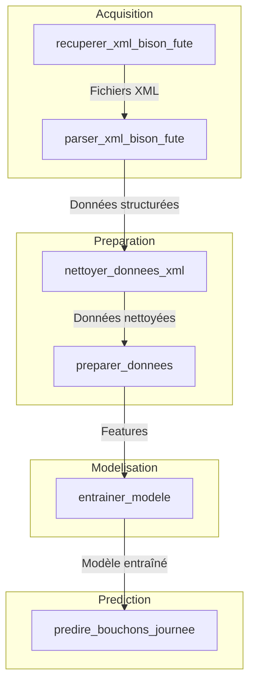
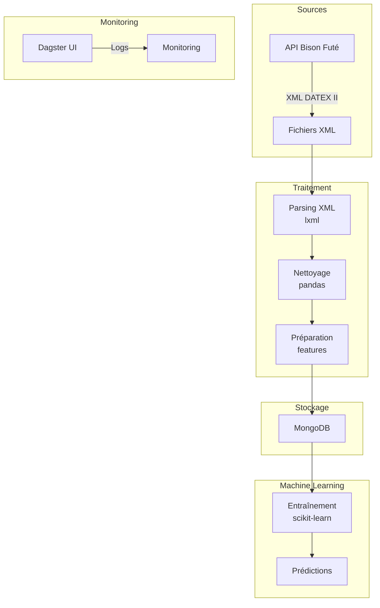
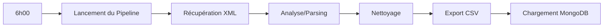
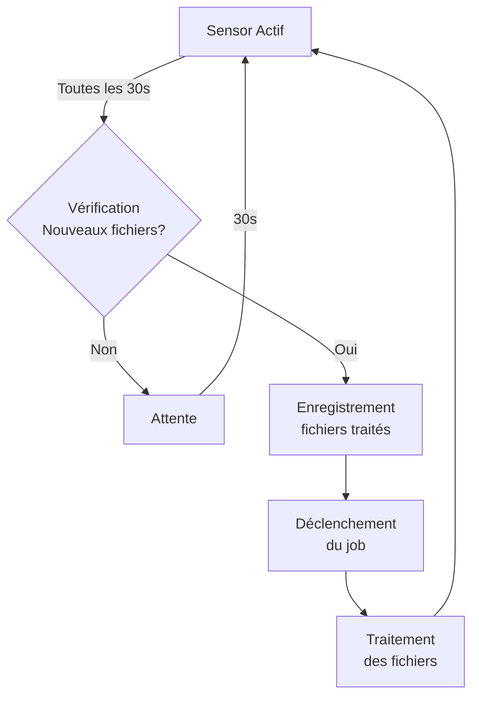

# Récolte et prédiction des embouteillages


# Pipeline de Données Bison Futé avec Dagster

Ce projet implémente une pipeline ETL complète permettant d'extraire, transformer et analyser et prédire les données d'événements routiers depuis l'API Bison Futé.

## Fonctionnalités

- Extraction automatique des fichiers XML d'événements routiers depuis l'API Bison Futé
- Parsing et transformation des données XML en format structuré
- Nettoyage et normalisation des données
- Entraînement et utilisation de modèles prédictifs pour anticiper les bouchons
- Analyses statistiques des événements routiers
- Planification automatique des actualisations de données

## Architecture

Le projet suit une architecture moderne avec trois composantes principales:

#### Acquisition des données

- Récupération des fichiers XML
- Parsing XML et extraction des données structurées

#### Préparation et analyse

- Nettoyage des données XML
- Préparation des données pour modélisation

#### Modélisation et prédiction

- Entraînement de modèles prédictifs
- Génération de prédictions de trafic pour les routes principales

---

## Technologies utilisées

| Catégorie                  | Technologie  | Description                                |
| -------------------------- | ------------ | ------------------------------------------ |
| **Orchestration**          | Dagster      | Orchestration de la pipeline de données    |
| **Base de données**        | MongoDB      | Stockage persistant des données            |
| **Traitement des données** | pandas       | Manipulation et transformation des données |
| **Parsing XML**            | lxml         | Traitement des fichiers XML                |
| **Machine Learning**       | scikit-learn | Modèles de prédiction du trafic            |
| **Conteneurisation**       | Docker       | Conteneurisation de l'application          |

---

## 🚀 Installation

### Prérequis

- Docker et Docker Compose
- Git

### Faire tourner le projet

1. Cloner le dépôt

```sh
git clone git@github.com:SUPMAP-DELTA-FORCE/supmap_data.git
cd dagster
```

2. Remplir les variables d'environnement

```sh
cp ./dagster/.env.example ./dagster/.env    # dont forget to fill in the values of each secret
```

3. Lancer les conteneurs Docker

```sh
docker compose up -d
task reset-no-cache
```

## Utilisation

Vous pouvez désormais accéder à l'interface Dagster

http://localhost:3000

Matérialisation manuelle des assets

- Accéder à l'interface Dagster
- Aller dans la section "Assets"
- Cliquer sur "Materialize all"

## Structure des assets

Le pipeline est composé de plusieurs assets qui s'exécutent dans un ordre spécifique pour traiter les données de trafic routier. Voici la structure détaillée :



### Description des assets

#### 1. Acquisition des données

- **recuperer_xml_bison_fute** : Récupère les fichiers XML depuis l'API Bison Futé
- **parser_xml_bison_fute** : Transforme les fichiers XML en données structurées

#### 2. Préparation des données

- **nettoyer_donnees_xml** : Nettoie et standardise les données extraites
- **preparer_donnees** : Prépare les données pour l'entraînement du modèle

#### 3. Modélisation

- **entrainer_modele** : Entraîne le modèle prédictif sur les données préparées

#### 4. Prédiction

- **predire_bouchons_journee** : Génère des prédictions de trafic pour les routes nationales et autoroutes

### Utilisation

Pour exécuter manuellement le pipeline :

1. Accéder à l'interface Dagster (http://localhost:3000)
2. Aller dans la section "Assets"
3. Cliquer sur "Materialize all"

---

## Architecture technique

#### Extraction des données

- Source : API Bison Futé (tipi.bison-fute.gouv.fr)
- Données : Fichiers XML DATEX II contenant des informations sur le trafic routier

#### Stockage

- MongoDB pour le stockage des données transformées

#### Transformation

- Parsing XML avec lxml
- Nettoyage et standardisation des données avec pandas
- Préparation des features pour l'apprentissage machine

#### Modélisation

- Modèles prédictifs basés sur scikit-learn
- Entraînement sur les données historiques
- Prédiction des conditions de trafic futures

#### Monitoring

- Logs détaillés accessibles via l'interface Dagster



---

## Scheduling

### La schedule (bison_fute_daily_schedule)

La schedule est configurée pour exécuter automatiquement le job mon_job tous les jours à 6h00 du matin.
En pratique, cela signifie que:
Chaque jour à 6h00 du matin, Dagster démarrera automatiquement le pipeline de traitement

Ce pipeline exécutera séquentiellement toutes les étapes définies dans le job:

- Récupération des fichiers XML
- Analyse (parsing) de ces fichiers
- Nettoyage des données extraites
- Export des données en CSV
- Chargement des données dans MongoDB
  Cette automatisation garantit que le traitement s'exécute quotidiennement sans intervention manuelle.



### Le sensor (bison_fute_file_sensor)

Le sensor surveille en continu l'arrivée de nouveaux fichiers XML dans un répertoire spécifié. Son fonctionnement est le suivant:

Le sensor s'active périodiquement (typiquement toutes les 30 secondes par défaut)
À chaque activation, il vérifie si de nouveaux fichiers XML sont apparus dans le répertoire surveillé
S'il détecte de nouveaux fichiers, il:

- Enregistre ces fichiers comme "déjà traités" pour ne pas les retraiter à l'avenir
- Déclenche immédiatement une exécution du job pour traiter ces nouveaux fichiers
- Si aucun nouveau fichier n'est détecté, il ne fait rien et attendra la prochaine vérification



### Perspectives d'évolution

Pour inclure les rues urbaines dans les prédictions, il faudrait:

- **Intégrer** des sources de données complémentaires (capteurs urbains, API tierces)
- **Adapter** le modèle de prédiction avec des features pertinentes pour le trafic urbain
- **Enrichir** la base de données d'entraînement avec des exemples de trafic en zone urbaine

### Contributeurs

## [<br /><sub><a href="https://github.com/Luluscript">Ludivine TULCIBIEZ</a></sub>](https://github.com/Luluscript)

## [<br /><sub><a href="https://github.com/naikibro">Vaanaiki Brotherson</a></sub>](https://github.com/naikibro)
